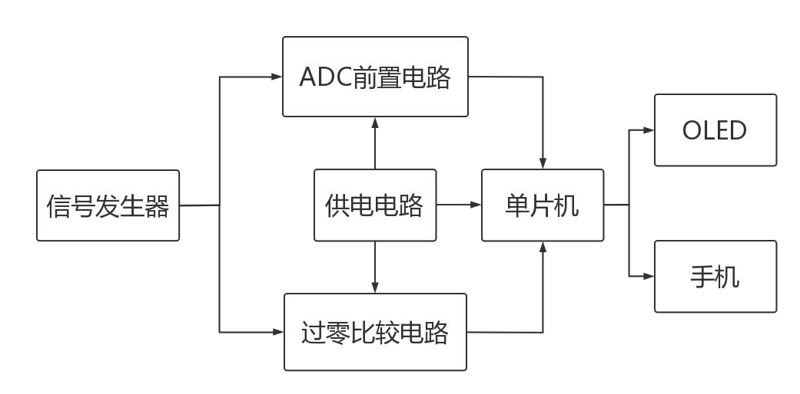
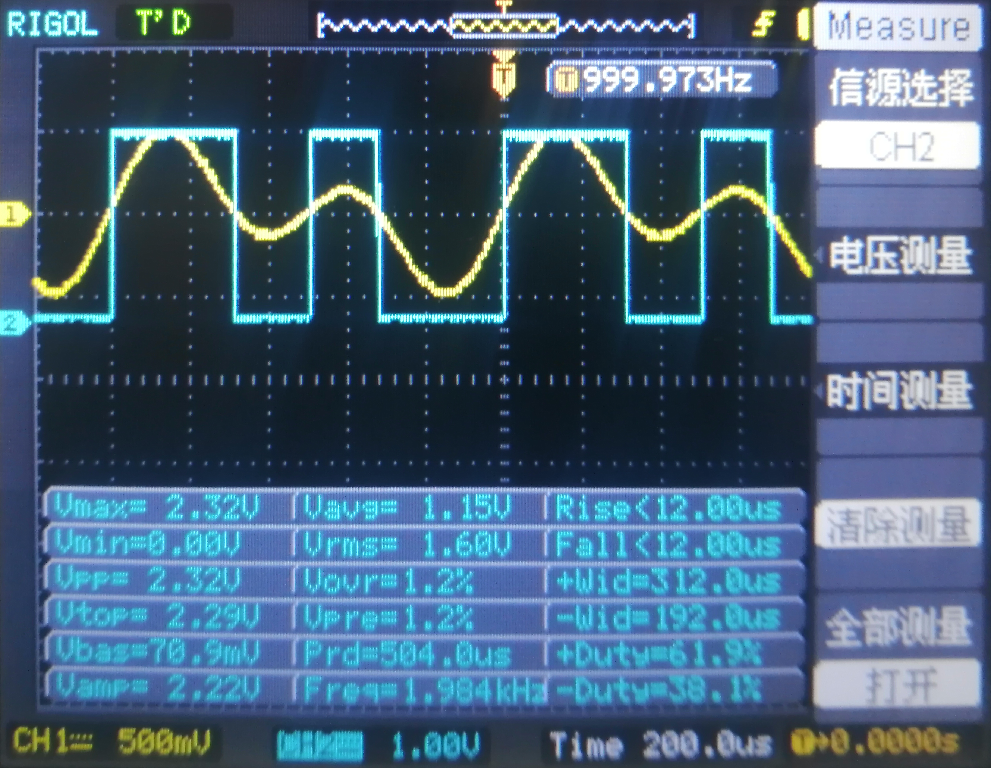
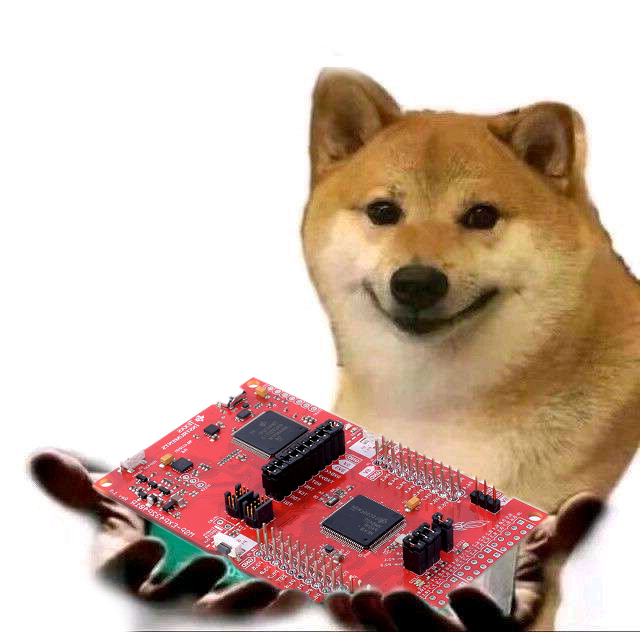

# 准满分！2021电赛A题省一！MSP432P401R
## 简要介绍
2021/11/11  作者：[@BILIBILI：m-RNA](https://space.bilibili.com/41224928  "@BILIBILI：m-RNA 个人主页")    E-mail：m-RNA@qq.com      
​		准满分！2021电赛A题省一！MSP432P401R的Keil工程。

​		感觉这个A题很像老师布置了检验MSP432学习成果的作业（不是），个人认为难点在于单品机片内ADC与DMA的联动配置，信号数字处理理论知识以及软件各算法的优化，如基波谐波的幅值查找、波形显示等的优化（个人见解）。  

​        此工程为了让学过Stm32的电赛人，能更易上手MSP432平台，将单片机外设初始化函数的封装都采用了Stm32正点原子风格。而且电赛人一般对Keil比较熟，故使用了Keil配置工程，方便VScode与Keil联动。当然CCS也可，如果会的话（可能后续会支持CCS）  

​		Doc文件夹有设计报告跟芯片数据手册以及单片机交互原型（xd文件用Adobe XD打开）  
​		Tool文件夹有OLED取模软件。  

​		视频演示：[点击观看](https://space.bilibili.com/41224928) （⚠️尚未录制上传）  
​		hxdm给我个Star⭐吧！别白嫖了😆！！秋梨膏！！!     
​		hxdm给我个Star⭐吧！别白嫖了😆！！秋梨膏！！!     
​		hxdm给我个Star⭐吧！别白嫖了😆！！秋梨膏！！!     

单片机特写： 

 

   

手机蓝牙APP：


整体合照：  


### 性能指标

1. 基础+发挥：

   - 测量信号频率范围：1kHz-120kHz
   - THDx误差小于4%（实际上总小于3%）
   - 归一化幅值显示
   - OLED波形显示
   - 手机显示THDx、归一化幅值、波形
   - 一键测量
   - 2s内完成测量显示
2. 其他部分：

   - 自制硬件模块
   - 显示信号周期
   - 可视化归一化幅值
   - 蜂鸣器提示测量完成
### 系统架构

本方案采用了满足题目要求的硬件，配合层次化的软件框架，实现对题目要求信号波形的采集、分析。

1. 硬件部分：为整个系统供电以及信号预处理等，最后将处理好的信号送入MSP432的ADC外设与定时器捕获外设，进行数据采集。

   - 供电电路：∓5V；
   - ADC前置电路：将信号放大、偏置；
   - 过零比较电路：将信号整形为脉冲。


2. 软件部分：底层驱动SDK框架、波形数据处理、人机交互界面等。
   - SDK提供基本的模块和外设驱动支持；
   - 波形处理计算如FFT、THDx、归一化幅值、还原波形和测量频率等，并为数据与波形显示做准备；
   - 人机交互界面提供屏幕显示（OLED和手机）和操作方式（按键）

整体系统示意：

  

程序流程示意：

  

Adobe XD 单片机交互原型设计示意：

  

### 谜之开源

- 本代码基于Apache-2.0开源，有引用或者修改本代码的地方，请标明作者及出处。尊重作者，尊重开源~  
- 仓库地址 ：https://gitee.com/chenjjian/RNA_2021_Game_A  

## 外设说明

### 1 串口
- 使用串口0打印调试信息至电脑，调试助手的波特率是1382400；

- 使用串口2与蓝牙通信进而与手机通信。  

```c
// 注： 可在main.c里的第52行代码直接更改波特率
uart_init(1382400);    // 第7讲 串口配置 （调试）
usart3_init(9600);     // 第7讲 串口配置 （蓝牙）
```

### 2 定时器A
- 定时器A0作为ADC触发时钟源；

- 定时器A2作为测量频率的输入捕获定时器

注：过零比较器给定时器A2通道1，即P5.7捕获，以获信号的频率；不接过零比较器，默认以50x16kHz进行采样（此时测量50kHz的信号最准确。原因：算法中采样频率是根据信号频率自适应改变的，以获得最优的测量结果）

```c
// 想要更改默认的fs，可以更改第54行代码
TimA0_Int_Init(60, 1); // 第8讲 定时器配置 （ADC触发时钟源 fs）
```

考虑了有多个过零点的情况，在软件算法有对此进行优化：

     

   

  

### 3 ADC采集+DMA传输
- P4.6输入 使用了内部2.5V参考电压源，放大后电压别超过2.5V。

- 开启了ADC通道DMA传输（特别感谢B站UP主：“CloudBoyStudio”，这一部分参考是CloudBoyStudio的配置）


### 4 双OLED显示 (硬件IIC)
- 使用了OLED图像库 [[移植：项目地址]](https://github.com/hello-myj/stm32_oled  "@GitHub： STM32 OLED图形库")

- 2个IIC协议的OLED，从机地址分别为0X78、0X7C，需要4个4.7k或10k电阻作为IIC上拉电阻。

```c
// 注：默认使用IIC_2 想更改硬件IIC引脚可以去oled_config.h第81行代码更改
#if (TRANSFER_METHOD==HW_IIC)
  //IIC_0: P1.7  -- SCL;  P1.6  -- SDA
  //IIC_1: P6.5  -- SCL;  P6.4  -- SDA
  //IIC_2: P3.7  -- SCL;  P3.6  -- SDA
  //IIC_3: P10.3 -- SCL;  P10.2 -- SDA
  #define USE_HW_IIC  IIC_2
```

>  使用两个小OLED的原因: 我们之前是做电源题的，考虑到降低功耗提高效率就使用了小OLED，怕OLED坏了，就买了很多备着，于是比赛时没有SPI协议或者IIC协议的较大屏幕，只能配合着OLED图形库，稍微添加了几条函数，使用IIC驱动两个小OLED。

### 5 蓝牙模块
使用了HC-05模块作为单片机与手机的无线通信模块。

### 6 外围电路

- 线性稳压芯片（如：7805、7905）

- 仪表放大器（如：INA128）

- 过零比较器（如：TLV3501）

## 赛后复盘

- 这道题是涉及”数字信号处理“的Ti-MCU限定题，MCU选型为C2000较有优势；
- 可以用滞回比较器来解决过零比较器的多零点问题，来减轻软件压力；
- 可以免去按键，改为开机自动测量，并多次测量，将测量结果去掉最值后求平均值，将单片机OLED的测量动画与手机显示动画去除，实时显示测量结果。

## 致谢名单

- 感谢B站UP主[“CloudBoyStudio”](https://space.bilibili.com/72364842 )一直无私奉献，耐心细致解答问题。本工程中很多代码，比如ADC的DMA传输配置等，参考了UP主“CloudBoyStudio”在MSP432学习交流群发出的示例代码，在此深表感谢😆
- 感谢积极细心的队友，硬件电路模块全部队友自制，而且在软件算法方面也给予了理论与实践帮助支持，在调试时帮忙揪出BUG，一起完成报告，给我瑜伽垫睡觉等；
- 感谢B站UP主“物联世界”视频教程；
- 感谢同学、老师、行知众创实验室提供的指导、仪器与场地支持；
- 感谢正点原子在Stm32平台的贡献，使得我们方便将代码移植到MSP432平台上来；
- 感谢MiniDSO-Pro项目，此工程的README与WaveBox()函数参考该项目；
- 感谢B站、UP主、B友、开源社区，让我发现了很多有趣且实用的项目，带给我很多欢乐、知识；
- 感谢爸妈，支持我烧钱打电赛；感谢未出现的女友，让我安心完成电赛；
- 感谢RNA的MSP432速成课，让我电赛延期不懈怠，坚持复习并分享MSP432P401R知识，谢谢你，狗子；
- ......

