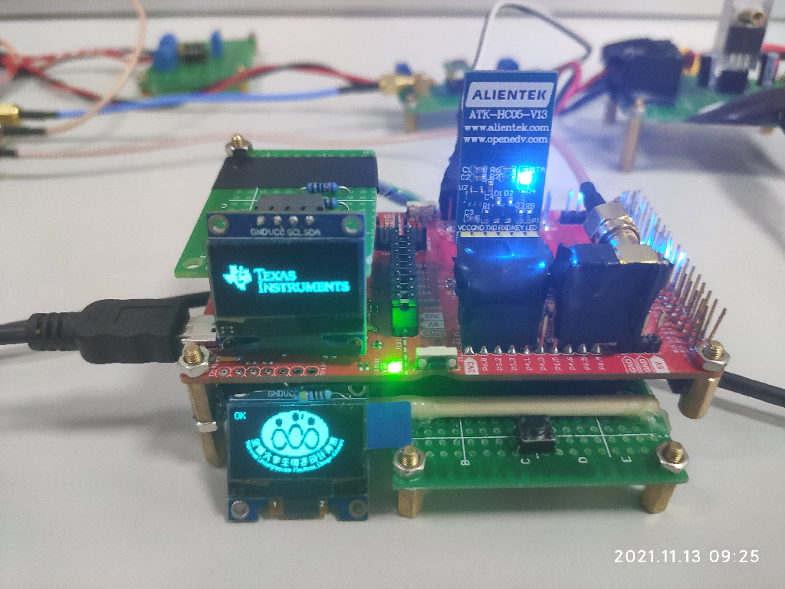
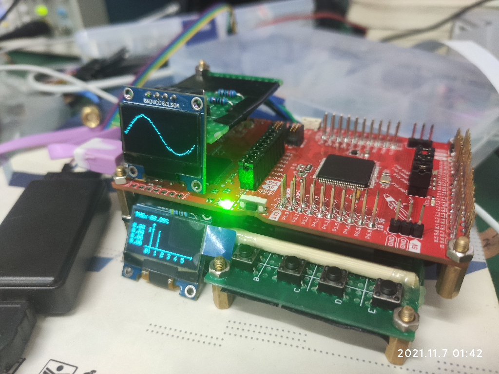
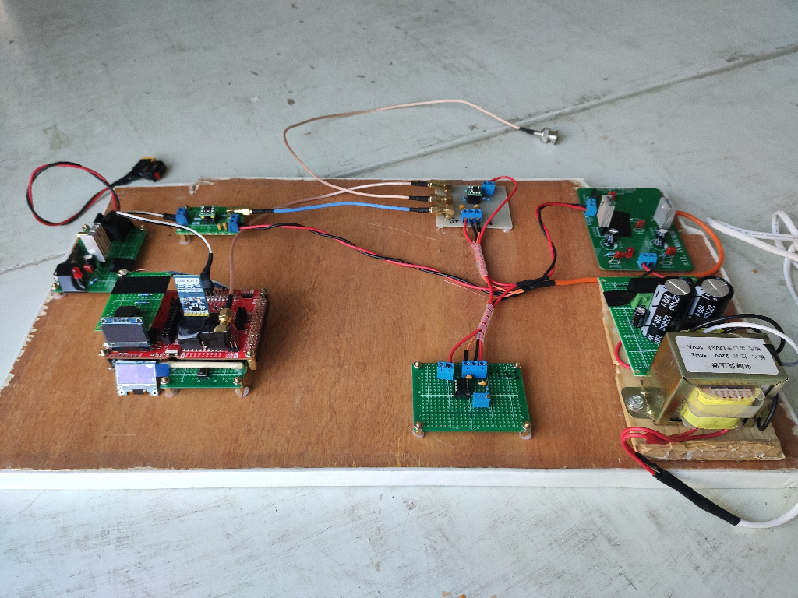
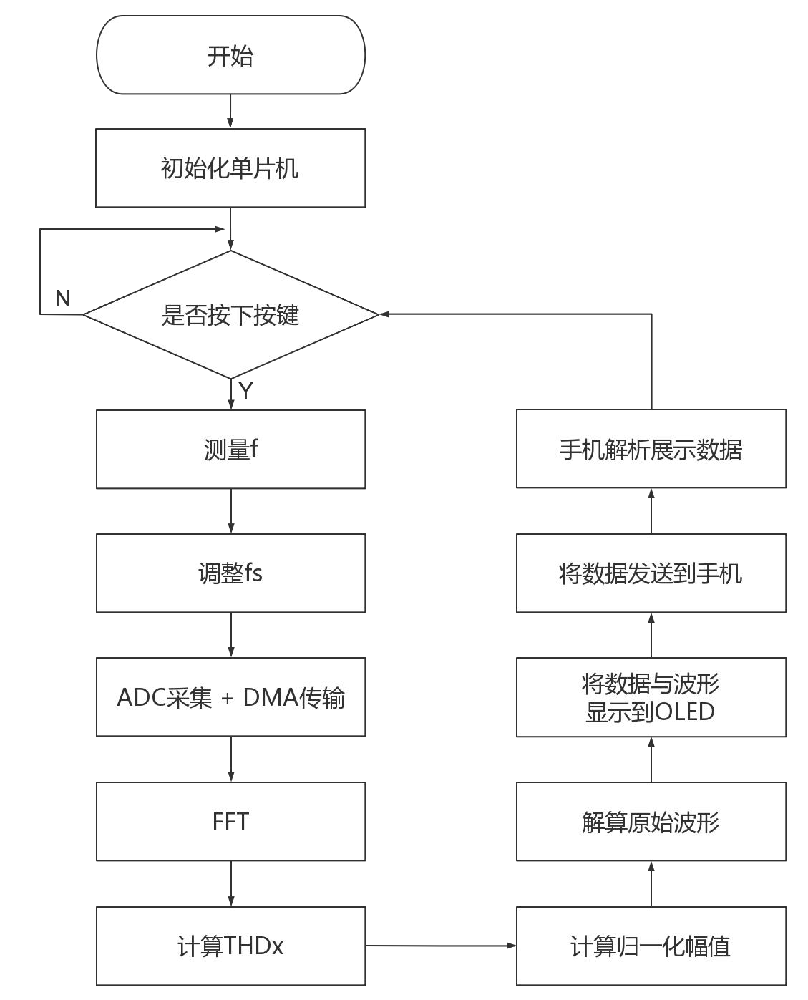
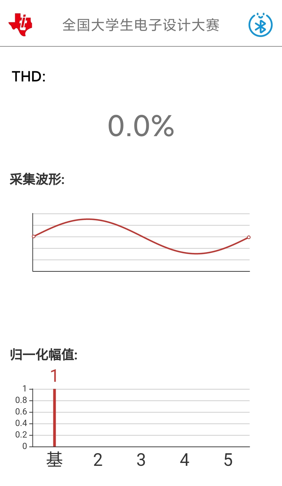
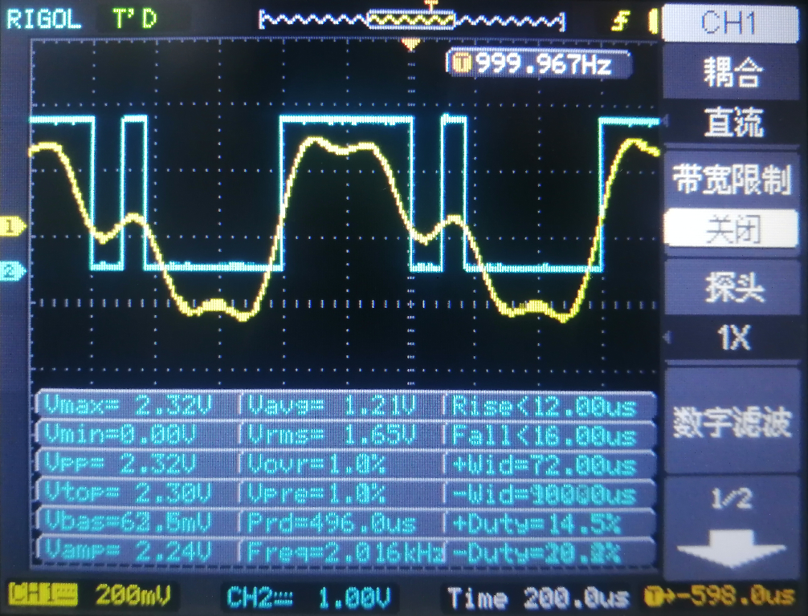

[TOC]

## 1.前言
2021/11/11  作者：[@BILIBILI：m-RNA](https://space.bilibili.com/41224928  "@BILIBILI：m-RNA 个人主页")    E-mail：m-RNA@qq.com      

    本作品为2021电赛A题-信号失真度测量装置，获得山西省赛区一等奖，全国二等奖。本人在此次比赛中专门负责单片机代码的编写，故只开源单片机代码部分。    
    此工程为了让学过Stm32的电赛人，能更易上手MSP432平台，将单片机外设初始化函数的封装都采用了Stm32正点原子风格。而且电赛人一般对Keil比较熟，故使用了Keil配置工程，方便VScode与Keil联动。当然CCS也可，如果会的话（可能后续会支持CCS）  
    Doc文件夹有芯片数据手册以及单片机交互原型（xd文件用Adobe XD打开）  
    Tool文件夹有OLED取模软件。  

视频演示：[点击观看](https://space.bilibili.com/41224928) （⚠️尚未录制上传）  
hxdm给我个Star⭐吧！别白嫖了😆！！秋梨膏！！！  
hxdm给我个Star⭐吧！别白嫖了😆！！秋梨膏！！！  
hxdm给我个Star⭐吧！别白嫖了😆！！秋梨膏！！！  


## 2.项目分析

2.1 基本要求  
  （1）输入信号的峰峰值电压范围：300mV-600mV。  
  （2）输入信号基频：1kHz。  
  （3）输入信号失真度范围：5%-50%。  
  （4）要求对输入信号失真度测量误差绝对值|THD~x~ - THD~o~|≤5%，THD~x~和THD~o~分别为失真度的测量值与标称值。   
  （5）显示失真度测量值THD~x~。  
  （6）失真度测量与显示用时不超过10秒。  
2.2 发挥部分  
  （1）输入信号的峰峰值电压范围：30mV-600mV。  
  （2）输入信号基频范围：1kHz-100kHz。  
  （3）测量并显示输入信号失真度THD~x~值，要求|THD~x~ - THD~o~|≤3%。  
  （4）测量并显示输入信号的一个周期波形。  
  （5）显示输入信号基波与谐波的归一化幅值，只显示到5次谐波。  
  （6）在手机上显示测量装置测得并显示的输入信号THD~x~值、一个周期波形、基波与谐波的归一化幅值。  
  （7）其他。  
2.3 题目分析  
    首先这是一道Ti-MCU限定题，并且题目要求测量的最高信号基频为100kHz，而且还要测量到五次谐波（5*100k=500kHz），若要满足采样定理则采样频率至少达到1MHz，故MSP432系列与C2000系列可以满足此题要求，但由于MSP423采用了大家较为熟悉的Cortex-M4f内核，支持DSP指令集和浮点运算指令集，学习成本低，故最终使用了MSP432P401R作为主控。  
    对于信号的采集，可以使用自适应的采用频率来采集信号；可以将通过滞回比较器或者过零比较器整形信号，给单片机捕获信号，获取频率；其次可以将信号放大、偏置后给单片机ADC采集。

## 3.实物展示

1. 作品局部单片机特写： 
 

2. 测量时OLED显示界面（电赛时匆忙拍的半成品）：



3. 整体合照：  



## 4.程序设计

    底层驱动SDK框架、波形数据处理、人机交互界面等（详细代码见附件） 

   - SDK提供基本的模块和外设驱动支持；
   - 波形处理计算如FFT、THD~x~、归一化幅值、还原波形和测量频率等，并为数据与波形显示做准备；
   - 人机交互界面提供屏幕显示（OLED和手机）和操作方式（按键）

程序流程示意：

  


单片机OLED交互原型设计示意(见附件，xd文件用Adobe XD打开)：

  

手机蓝牙APP界面展示：



## 5.赛后总结

    此次比赛中印象较深的就是手机蓝牙APP编写，在通信协议的确定和手机端解析代码的编写浪费了好多时间。其次，由于比赛节奏较快，此次作品没能做到面面俱到，我总结出此作品可以优化的几点：    

- 这道题是涉及“数字信号处理”的Ti-MCU限定题，MCU选型应该为C2000较有优势；
- 可以用滞回比较器来解决过零比较器的多零点问题，来减轻软件压力；
- 可以有第二种模式，不用按键，改为连续测量，并多次测量，将测量结果去掉最值后求平均值，将单片机OLED的测量动画与手机显示动画去除，实时显示测量结果，增强实时性、减少误差；

## 6.致谢名单

- 感谢B站UP主[“CloudBoyStudio”](https://space.bilibili.com/72364842 )一直无私奉献，耐心细致解答问题。本工程中很多代码，比如ADC的DMA传输配置等，参考了UP主“CloudBoyStudio”在MSP432学习交流群发出的示例代码，在此深表感谢😆
- 感谢积极细心的队友，硬件电路模块全部队友自制，而且在软件算法方面也给予了理论与实践帮助支持，在调试时帮忙揪出BUG，一起完成报告，给我瑜伽垫睡觉等；
- 感谢B站UP主“物联世界”视频教程；
- 感谢同学、老师、行知众创实验室提供的指导、仪器与场地支持；
- 感谢正点原子在Stm32平台的贡献，使得我们方便将代码移植到MSP432平台上来；
- 感谢MiniDSO-Pro项目，此工程的README与WaveBox()函数参考该项目；
- 感谢B站、UP主、B友、开源社区，让我发现了很多有趣且实用的项目，带给我很多欢乐、知识；
- 感谢爸妈，支持我烧钱打电赛；感谢未出现的女友，让我安心完成电赛；
- 感谢RNA的MSP432速成课，让我电赛延期不懈怠，坚持复习并分享MSP432P401R知识，谢谢你，狗子；
- ......


## 附录：单片机工程说明

0 引脚连接

> 引脚可自行配置，OLED引脚更改下文有提示。

<table>
	<tr>
	    <th>外设</th>
	    <th>引脚(外设)</th>
	</tr>
    <tr>
	    <td>ADC采样</td>
	    <td>P4.6</td>
	</tr>
    <tr>
	    <td>过零比较</td>
	    <td>P5.7</td>
	</tr>
	<tr >
	    <td rowspan="2">OLED显示</td>
	    <td>P3.6(SDA)</td>
	</tr>
	<tr>
	  	<td>P3.7(SCL)</td>
	</tr>
	<tr>
    <tr >
	    <td rowspan="2">蓝牙串口</td>
	    <td>P3.2(TXD)</td>
	</tr>
	<tr>
	  	<td>P3.3(RXD)</td>
	</tr>
</table>

1 串口使用

- 使用串口0打印调试信息至电脑，调试助手的波特率是1382400；

- 使用串口2与蓝牙通信进而与手机通信。  

```c
// 可在main.c里的第52行代码直接更改波特率
uart_init(1382400);    // 第7讲 串口配置 （调试）
usart3_init(9600);     // 第7讲 串口配置 （蓝牙）
```

2 定时器A
- 定时器A0作为ADC触发时钟源；

- 定时器A2作为测量频率的输入捕获定时器。

>  过零比较器给定时器A2通道1，即P5.7捕获，以获信号的频率；不接过零比较器，默认以50x16kHz进行采样（此时测量50kHz的信号最准确。原因：算法中采样频率是根据信号频率自适应改变的，以获得最优的测量结果）

```c
// 想要更改默认的fs，可以更改第54行代码
TimA0_Int_Init(60, 1); // 第8讲 定时器配置 （ADC触发时钟源 fs）
```

考虑了有多个过零点的情况，在软件算法有对此进行优化：

    

3 ADC采集+DMA传输
- P4.6输入 使用了内部2.5V参考电压源，放大后电压别超过2.5V。

- 开启了ADC通道DMA传输（特别感谢B站UP主：“CloudBoyStudio”，这一部分参考是CloudBoyStudio的配置）

4 双OLED显示 (硬件IIC)
- 使用了OLED图像库 [[移植：项目地址]](https://github.com/hello-myj/stm32_oled  "@GitHub： STM32 OLED图形库")

- 2个IIC协议的OLED，从机地址分别为0X78、0X7C，需要4个4.7k或10k电阻作为IIC上拉电阻。

```c
// 默认使用IIC_2 想更改硬件IIC引脚可以去oled_config.h第81行代码更改
#if (TRANSFER_METHOD==HW_IIC)
  //IIC_0: P1.7  -- SCL;  P1.6  -- SDA
  //IIC_1: P6.5  -- SCL;  P6.4  -- SDA
  //IIC_2: P3.7  -- SCL;  P3.6  -- SDA
  //IIC_3: P10.3 -- SCL;  P10.2 -- SDA
  #define USE_HW_IIC  IIC_2
```

>  使用两个小OLED的原因: 我们之前是做电源题的，考虑到降低功耗提高效率就使用了小OLED，怕OLED坏了，就买了很多备着，于是比赛时没有SPI协议或者IIC协议的较大屏幕，只能配合着OLED图形库，稍微添加了几条函数，使用IIC驱动两个小OLED。

5 无线通信
使用了HC-05蓝牙模块作为单片机与手机的无线通信模块。简易通信协议如下：

| 内容     | 开始 | THD       | 波形       | 归一化幅值   | 结束 |
| -------- | ---- | --------- | ---------- | ------------ | ---- |
| 长度(字) | NULL | 1         | 1x128      | 1x5          | NULL |
| 备注     | 空   | 放大1千倍 | 幅值为0-64 | 频率由低到高 | 空   |

6 外围电路

- 线性稳压芯片（如：7805、7905）

- 仪表放大器（如：INA128）

- 过零比较器（如：TLV3501）